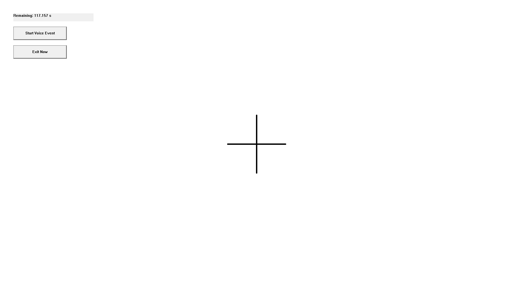

Experimental Data Collection for Targeted Individuals
=====================================================

⚠️ Disclaimer

This project is a data collection tool intended to record EEG responses during user-perceived auditory events (e.g., intrusive thoughts, internal speech, or anomalous voice-like experiences).

It does not assert the cause or origin of these perceptions.
It is intended for non-clinical, exploratory research only.

The objective is to:

    Capture EEG patterns in a controlled baseline state

    Enable participants to mark perceived events

    Compare baseline vs. event EEG characteristics

This may help researchers analyze subjective perceptual phenomena using quantitative EEG methods.

✅ Clean Baseline for Voice Detection

    “Do nothing. Sit still. Keep your eyes open, stare at a fixed point. Let your mind stay empty.”

Why?

    No thinking

    No inner speech

    No physical movement

    No emotional reaction

This makes the EEG signal flat, regular, and stable — so any injected voice causes a clear disturbance.

Assumption: You have Olimex EEG-SMT plugged in and it is working properly when you try it with https://github.com/michaloblastni/local-neural-monitoring

🧪 Repeatable Procedure
Baseline Task:

    Sit in a chair, back straight

    Look at a simple black cross on a white screen or paper

    Eyes open, don’t blink too much

    Don’t think anything. Don’t move. Just observe.

Duration:

    2 minutes before recording starts

    Repeat 1-minute blocks between events

Marking:

    Click "Start Voice Event" to mark a situation when you suddenly hear some insulting comment the task, and click "End Voice Event" to mark when the comment ended. Try to be as precise as possible.

🔍 Why It Works

    You define the "normal EEG" when no voices and no thoughts are present

    Then compare it to the EEG during voice events

    Any sudden activity — spikes, entropy change, gamma burst — is meaningful

📊 Experimental Data Analysis
    Compute and compare:

        Band power (especially gamma)

        Entropy

        Sudden shifts

🧠 Overview of the Jupyter Notebook's Capabilities
1. Data Loading and Preprocessing

    EEG Data Import: Reads eeg_data.csv, containing timestamped EEG recordings from two channels.

    Event Log Import: Reads baseline_log.csv, detailing event timings such as baseline_start, baseline_end, voice_event_start, and voice_event_end.

    Filtering: Applies a bandpass filter (1–40 Hz) to isolate relevant EEG frequencies, removing noise and artifacts.
    MNE Tools+1MNE Tools+1

2. Event Segmentation

    Baseline Period: Identifies the time window between baseline_start and baseline_end.

    Voice Events: Detects periods marked by voice_event_start and voice_event_end, allowing for targeted analysis of these intervals.

3. Visualization

    Time-Domain Plots: Displays the filtered EEG signals over time for both channels, providing a visual assessment of signal quality and event-related changes.

    Power Spectral Density (PSD): Computes and plots PSD for the baseline and each voice event, highlighting frequency components and potential anomalies.

4. Frequency Band Analysis

    Band Power Calculation: Quantifies power within standard EEG bands—Delta (0.5–4 Hz), Theta (4–8 Hz), Alpha (8–13 Hz), Beta (13–30 Hz), and Gamma (30–45 Hz)—for both baseline and voice events.

    Comparative Analysis: Facilitates comparison of band powers between baseline and voice events, aiding in the identification of significant deviations.

🔍 Insights Derived from the Analysis

    Baseline Characterization: Establishes a reference for "normal" EEG activity, essential for detecting deviations during voice events.

    Event-Related Changes: Identifies alterations in EEG patterns during voice events, such as increased gamma activity, which may indicate cognitive or sensory processing.

    Signal Quality Assessment: Visualizations and PSD plots help assess the quality of EEG recordings, ensuring reliability of subsequent analyses.
